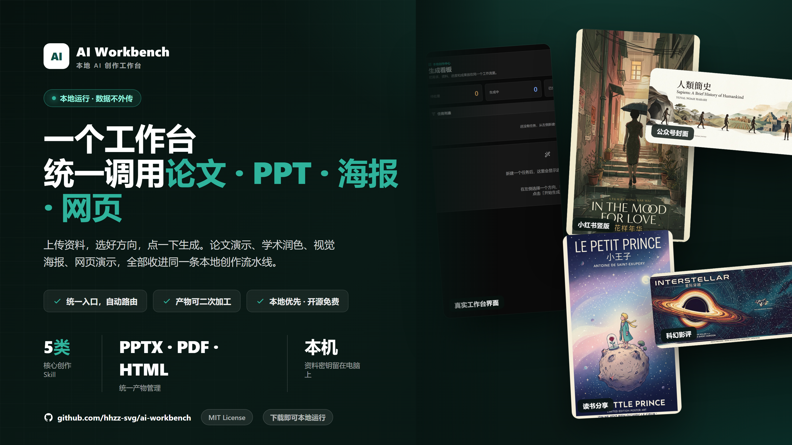

# AI Workbench - 本地 AI 创作工作台

[](https://opensource.org/licenses/MIT)
[](https://www.python.org/downloads/)
[](https://nodejs.org/)

把论文、资料和创作需求放进一个本地工作台，生成组会 PPT、学术海报、网页演示、润色稿和视觉海报。普通用户保存 OpenAI-compatible API 配置即可运行；已经安装 Codex CLI 的用户也可以选择本机 Codex 环境。

<p align="center">
  
</p>

**10 秒演示视频**：[点击查看 `readme-demo.mp4`](landing-page/assets/readme-demo.mp4)

## 适合谁

- 需要把论文 PDF、实验图和阅读笔记整理成组会/答辩演示的人
- 需要生成学术海报、课程海报或网页演示的人
- 想把不同 AI 创作流程收进一个本地任务看板的人
- 不想把资料、API Key 和生成结果交给陌生在线服务的人

## 🌐 在线展示页

展示页地址：**https://ai-workbench-cvs.pages.dev/**

> 说明：这个地址只是项目介绍和下载入口，不是在线版工作台。当前完整程序需要下载到本地运行，任务执行、模型配置、上传文件和生成结果都保存在自己的电脑上。

## 🖥️ 当前使用方式

AI Workbench 目前是本地应用，不是云端 SaaS。你需要在电脑上启动后端和前端，然后访问本地地址使用。

- 本地工作台地址：`http://127.0.0.1:5173`
- 后端 API 文档：`http://127.0.0.1:8000/docs`
- 数据保存位置：`~/.skill-workbench`
- 推荐运行方式：保存 API Base URL、模型和 API Key 后直接创建任务
- 可选运行方式：不保存 API 配置，使用本机 Codex CLI 环境

## ✨ 核心亮点

- 🧩 **集成多种创作 Skill 接口**：把 PPT、论文润色、网页演示、学术海报、视觉海报等能力统一到一个工作台里调用。
- 🎯 **自动路由到合适 Skill**：输入需求后，系统会按关键词和任务类型选择对应 Skill，减少手动切换工具的成本。
- 📦 **统一产物管理**：不同 Skill 生成的 PPTX、Markdown、HTML、PDF、图片和配置文件都会进入同一个任务看板。
- 🔄 **AI 二次处理**：对已生成的图片、HTML、PDF 等产物继续追加修改要求，创建新的再加工任务。
- 🔒 **本地优先运行**：上传资料、模型配置、API Key、任务记录和生成文件都保存在本机，适合论文、课题组资料和未公开内容。
- ⚙️ **API 优先，Codex 可选**：支持 OpenAI-compatible API 配置；已安装 Codex CLI 的用户可使用本机默认环境。

## 🧠 已集成 Skill 接口

| Skill | 适合做什么 | 主要产物 |
|------|------------|----------|
| `nature-paper2ppt` | 论文、实验图、阅读笔记转中文组会/答辩 PPT | `final_presentation_cn.pptx`、检查报告、图表资源 |
| `nature-polishing` | 学术段落、摘要、章节润色或重写 | `polished.md`、`revision_notes.md` |
| `guizang-ppt-skill` | 主题素材生成横向翻页网页演示 | `ppt/index.html`、图片资源 |
| `make-poster` | 论文材料生成会议/科研学术海报 | `poster/index.html`、`poster.pdf`、配置文件 |
| `mondo-poster-design` | 活动、品牌、封面、英文视觉海报方案 | 海报提示词、设计包、图片输出 |

这些 Skill 原本分散在不同创作流程里，本项目把它们包装成统一 API 和统一前端入口：上传资料、选择方向、提交任务、看进度、下载产物都在同一个界面完成。

## 🚀 快速开始

### Windows 用户 - 下载发布包

1. 从 [Releases](https://github.com/hhzz-svg/ai-workbench/releases) 下载 `ai-workbench-windows-<version>.zip`
2. 解压后双击 `install.bat`
3. 双击 `start.bat`
4. 浏览器打开后进入「设置」，保存 API Base URL、模型和 API Key
5. 回到「新建」，上传资料并开始生成

仓库内也提供了 `examples/sample-paper-notes.md`，可以作为第一次试跑的示例资料。

详细说明见 [docs/ONE_CLICK_START.md](docs/ONE_CLICK_START.md)

---

### 从源码启动（开发者）

**1. 克隆仓库**

```bash
git clone https://github.com/hhzz-svg/ai-workbench.git
cd ai-workbench
```

**2. 安装依赖**

```bash
# 后端
python -m pip install -r backend/requirements.txt

# 前端
cd frontend
npm install
cd ..
```

**3. 启动服务**

```bash
# Windows PowerShell
.\start.ps1

# 或手动启动
# 终端 1
python -m uvicorn app.main:app --app-dir backend --host 127.0.0.1 --port 8000

# 终端 2
cd frontend
npm run dev
```

打开 `http://127.0.0.1:5173`。

首次使用请进入「设置」保存 API 配置；如果你已经安装 Codex CLI，也可以在创建任务时选择本机 Codex 环境。

### 4. 局域网使用

同一网络里的其他人要访问这台电脑上的工作台，可以运行：

```powershell
.\start-lan.ps1
```

脚本会显示可访问地址，例如 `http://192.168.1.20:5173`。别人只打开网页，真正的模型配置、任务执行和文件仍在这台电脑上。

## 📖 使用指南

### 1. 创建任务

**方式一：使用快速开始模板**
- 点击预设模板（论文演示、网页演示等）
- 模板会自动填充提示词和配置

**方式二：使用快速配置**
- 🇨🇳 **中文PPT**：中文演示文稿配置
- 🇬🇧 **英文海报**：英文学术海报配置
- 🌐 **网页演示**：HTML 展示配置

**方式三：自由配置**
- 展开高级选项
- 自定义语言、格式、约束等参数

### 2. 上传参考资料（可选）

支持上传论文 PDF、图片、笔记等参考文件。

### 3. 指定输出路径（可选）

在"输出文件存储路径"框中输入自定义保存路径，例如：
```
C:\Users\你的用户名\Documents\我的作品
```

留空则使用默认路径 `~/.skill-workbench/jobs/`。

### 4. AI 二次处理

对已生成的文件进行修改：

1. 在产物列表中找到文件
2. 点击"添加注释"按钮
3. 输入修改要求，例如：
   - "将配色改为蓝色系"
   - "添加公司 Logo"
   - "基于这个PPT生成演讲稿"
4. 点击"提交处理"
5. 系统会创建新任务进行 AI 再加工

## 📁 数据存储

默认只在本机运行。后端数据、上传文件、密钥和产物都保存在当前电脑的 `~/.skill-workbench`：

```
~/.skill-workbench/
├── app.db           # 任务和配置数据库
├── uploads/         # 上传的文件
├── jobs/            # 任务工作目录
└── keys/            # 加密存储的 API Key
```

## ⚙️ 模型配置

### API 配置（推荐）

普通用户推荐直接保存 OpenAI-compatible API 配置。配置只保存在本机。

1. 进入"设置"页面
2. 填写配置信息：
   - **配置名称**：如"学校代理"
   - **Base URL**：API 端点地址
   - **模型**：模型名称
   - **API Key**：访问密钥
3. 点击"测试连接"验证配置
4. 保存后可在创建任务时选择

### 本机 Codex 环境（可选）

如果已经安装 Codex CLI，也可以不保存 API 配置，直接使用本机默认环境。`install.bat` 会检测 Codex CLI，但缺少 Codex 不会阻止普通 API 模式使用。

## 🏗️ 项目结构

```
skill-workbench/
├── backend/           # FastAPI 后端
│   ├── app/
│   │   ├── main.py       # 主应用和 API 路由
│   │   ├── models.py     # 数据模型
│   │   ├── store.py      # SQLite 数据存储
│   │   ├── jobs.py       # 任务队列管理
│   │   └── runner.py     # Codex 执行器
│   └── tests/
├── frontend/          # React + Vite 前端
│   ├── src/
│   │   ├── main.tsx      # 主组件
│   │   ├── api.ts        # API 客户端
│   │   ├── types.ts      # TypeScript 类型
│   │   └── styles.css    # 样式
│   └── dist/             # 构建产物
├── start.ps1          # 本机启动脚本
├── start-lan.ps1      # 局域网启动脚本
└── README.md
```

## 🔌 API 文档

### 主要端点

- `POST /api/jobs` - 创建任务
- `GET /api/jobs` - 获取任务列表
- `GET /api/jobs/{job_id}/events` - 任务进度流（SSE）
- `GET /api/jobs/{job_id}/artifacts` - 获取任务产物
- `GET /api/artifacts/{artifact_id}/download` - 下载产物
- `POST /api/artifacts/{artifact_id}/annotate` - AI 二次处理 ✨新功能
- `POST /api/files` - 上传文件
- `GET /api/providers` - 模型配置管理

完整 API 文档：启动后访问 http://127.0.0.1:8000/docs

## 📝 更新日志

### V2.0.0 (2026-06-15)

**新功能：**
- ✅ AI 二次处理：对生成文件进行注释和再加工
- ✅ 自定义输出路径：指定文件保存位置
- ✅ 快速配置按钮：一键设置常用参数
- ✅ 高级选项折叠：简化界面

**改进：**
- ✅ 修复快速配置按钮无效问题
- ✅ 修复模板提示词覆盖问题
- ✅ 精简产物显示：去除预览，只显示文件信息和路径
- ✅ 改进 UI 动画和视觉效果

详见 [docs/UPDATES_V2.md](docs/UPDATES_V2.md)

## ⚠️ 注意事项

生成耗时较长是正常的：一次任务会读取资料、规划结构、调用模型、写入产物并索引文件；演示、海报和图片类任务通常比普通聊天更久（数分钟）。

## 🤝 贡献

欢迎贡献代码、报告问题或提出建议！

1. Fork 本仓库
2. 创建特性分支 (`git checkout -b feature/AmazingFeature`)
3. 提交更改 (`git commit -m 'Add some AmazingFeature'`)
4. 推送到分支 (`git push origin feature/AmazingFeature`)
5. 打开 Pull Request

## 📄 许可证

MIT License - 详见 [LICENSE](LICENSE) 文件

## 🙏 致谢

- [FastAPI](https://fastapi.tiangolo.com/) - 后端框架
- [React](https://react.dev/) - 前端框架
- [Vite](https://vitejs.dev/) - 构建工具
- [Lucide Icons](https://lucide.dev/) - 图标库

---

**⭐ 如果这个项目对你有帮助，请给一个 Star！**
